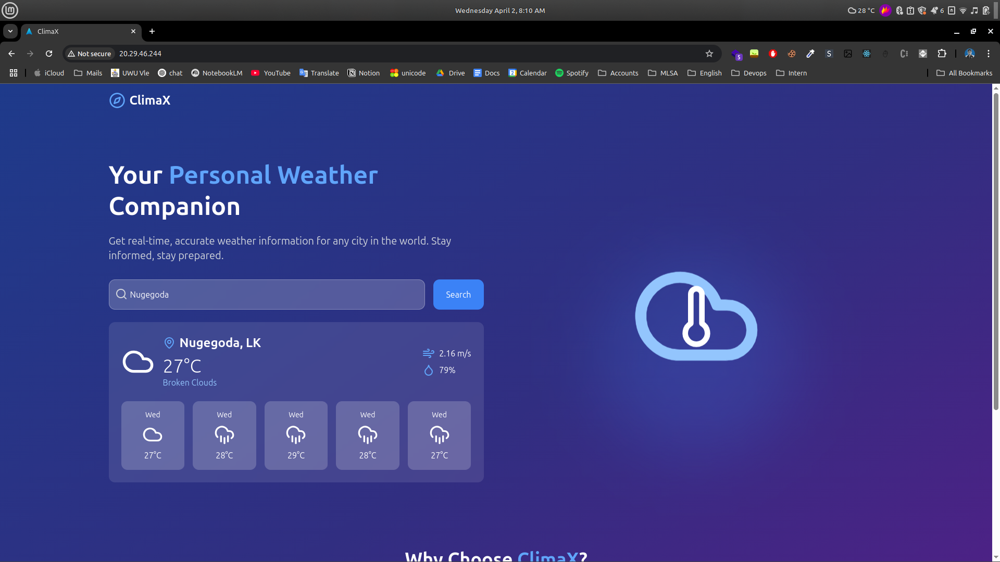
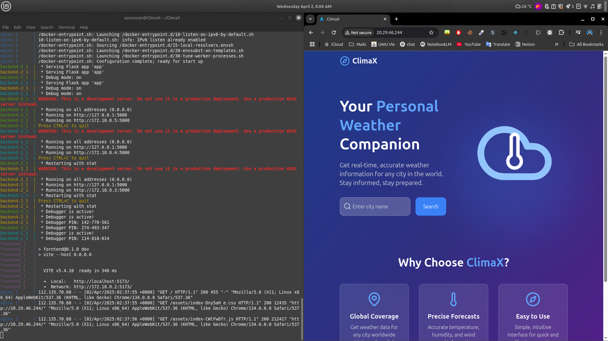
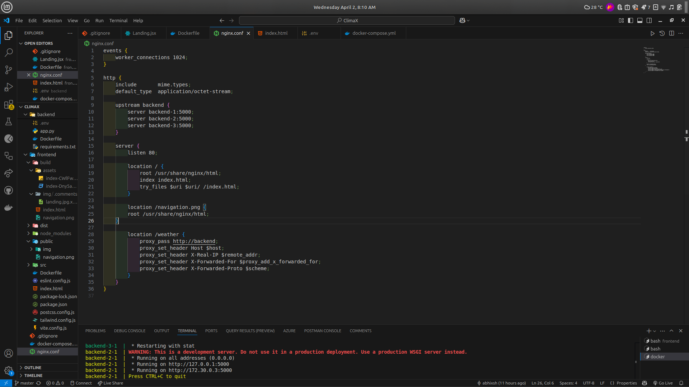
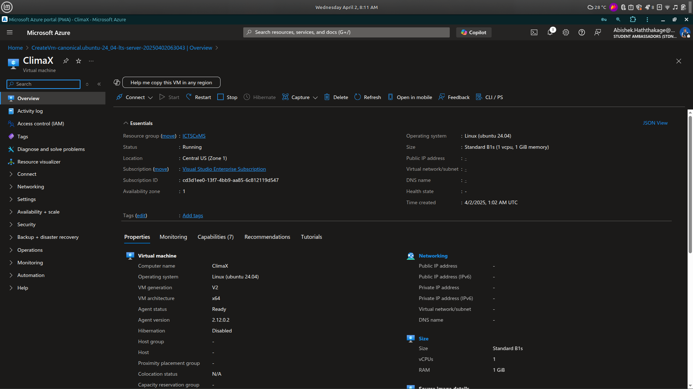
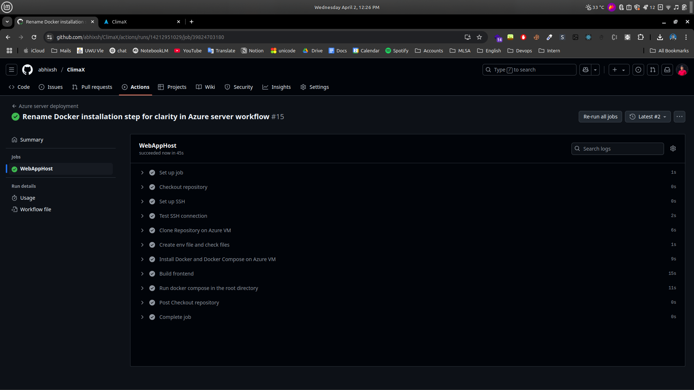
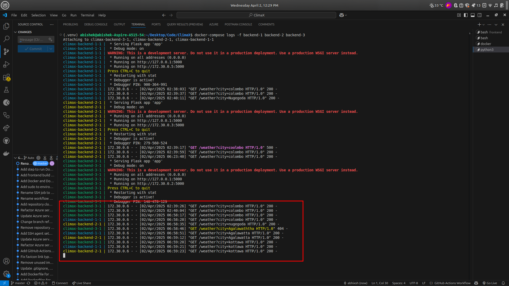

# ClimaX - Weather Application

## Overview
ClimaX is a weather forecasting application built using a modern tech stack. The application is designed to provide accurate weather updates by leveraging APIs and delivering data to users through a responsive frontend interface. The backend is built using Python, and Docker is used for containerization. NGINX is employed for load balancing to ensure optimal performance. The application is hosted on an Azure VM, and GitHub Actions is used for continuous deployment.

## Features
- **Weather Forecasting**: Real-time weather updates, including temperature, humidity, and wind speed
- **Frontend**: Built using React.js and styled with Tailwind CSS for a responsive and modern user interface
- **Backend**: Developed using Python, communicating with external APIs to fetch weather data
- **Docker**: Utilizes multistage builds to create lightweight containers for both frontend and backend
- **Load Balancing**: NGINX setup for round-robin load balancing across multiple backend instances
- **Continuous Deployment**: GitHub Actions configured for automated build and deployment to Azure VM

## Tech Stack
- **Frontend**: React.js, Tailwind CSS
- **Backend**: Python (Flask/FastAPI)
- **Containerization**: Docker (Multistage Builds)
- **Load Balancing**: NGINX (Round-robin load balancing)
- **CI/CD**: GitHub Actions
- **Hosting**: Azure Virtual Machine (VM)

## Demo Images
Here are some demo images of the ClimaX application:






## Project Setup

### Prerequisites
- Docker
- Node.js and npm (for frontend build)
- Python (for backend development)
- Azure account (for hosting the app on a VM)
- GitHub repository for version control

### Running Locally
1. Clone the repository:
```bash
git clone https://github.com/yourusername/ClimaX.git
cd ClimaX
```

2. Build the frontend:
```bash
cd frontend
npm install
npm run build
```

3. Build the backend:
```bash
cd backend
pip install -r requirements.txt
```

4. Run Docker containers:
```bash
docker-compose up --build
```
> This will start the frontend, backend, and NGINX container.
